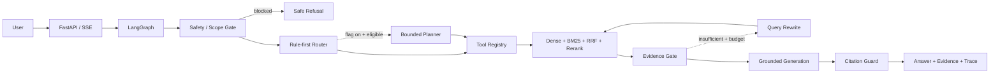
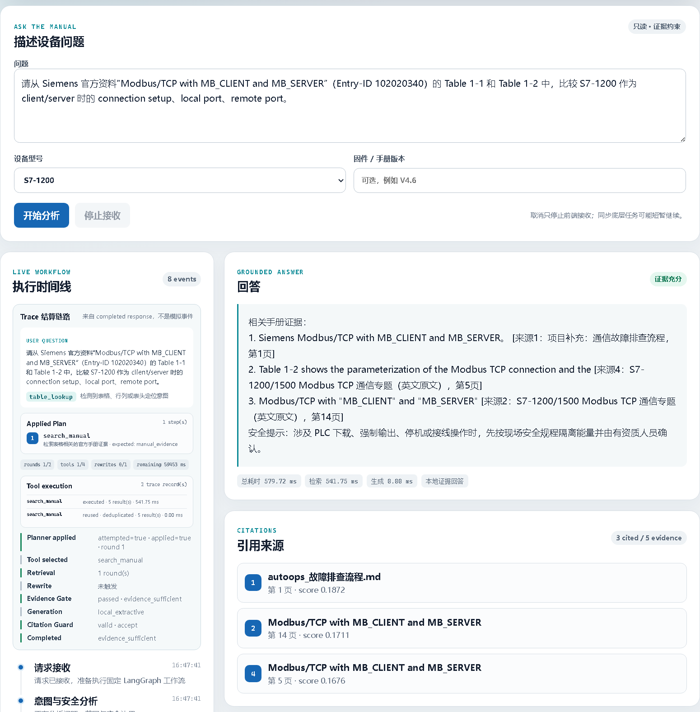

# AutoOps RAG

面向 Siemens S7-1200 与 Modbus 技术资料的工业手册检索与故障辅助系统。项目重点不是“接一个向量库再让 LLM 回答”，而是把工具调用、混合检索、证据判断、问题改写、引用校验、Trace 和规则型端到端评测做成一条可审计链路。

当前应用与 API 版本：`4.1.0`。

## 60 秒了解项目

### 解决什么问题

工业手册篇幅长、表格密集，故障码、参数、版本和排查流程常分散在不同页面。单纯向量检索容易漏掉 `16#80C8`、`MB_CLIENT`、`Unit ID` 等精确标识；直接让 LLM 使用 TopK 文本又可能遗漏关键事实或生成证据外内容。

AutoOps RAG 提供只读知识辅助：检索手册、查询结构化故障码和参数、判断证据是否足够，并返回可回溯到文档、页码和 chunk 的回答。系统不连接 PLC，不执行下载、写寄存器、强制输出或旁路安全联锁。

### 与 naive RAG 的区别

| naive RAG 常见做法 | AutoOps RAG |
|---|---|
| 一次 Dense Retrieval | Dense + BM25 + RRF + 轻量 Rerank，兼顾语义与精确标识 |
| 普通文本切分 | 页级正文 + 表格行双表示，保留表头、行号、页码、型号和版本 |
| TopK 直接交给 LLM | 生成前经过证据充分性判断（Evidence Gate） |
| 回答有引用编号即可 | 引用校验（Citation Guard）验证引用是否属于本次 Evidence |
| Agent 自由循环调用工具 | 默认固定 Graph；可选确定性 Planner，受白名单、budget、timeout、去重和 fallback 限制 |
| 只报告 Recall | Retrieval 与 End-to-End 规则指标分层，不把 Recall 当最终回答准确率 |

### 当前真实调用链

```text
用户请求 -> FastAPI -> LangGraph -> Safety / Scope Gate
        -> 规则优先路由 -> 可选受控 Planner -> Tool Registry
        -> Hybrid Retrieval / 结构化工具 -> Evidence Gate
        -> Query Rewrite（必要时）-> LLM 或本地证据摘要
        -> Citation Guard -> Answer + Evidence + Trace
```



### 当前 React Demo



图中是一次真实受控执行：Planner 是 deterministic / rule-based planner，不是 LLM Planner；它只对部分 intent 启用，其余请求仍走稳定固定流程。React 通过 workflow-level SSE 展示阶段事件（不是 token streaming），最终回答随 `completed` 事件一次性返回。

### 当前正式评测

当前事实总表见 [docs/current-status.md](docs/current-status.md)，机器可读 canonical report 为 [reports/formal_evaluation.json](reports/formal_evaluation.json)。

| 当前项目规模 | 当前值 | 当前验证状态 | 当前值 |
|---|---:|---|---:|
| 文档 | 6 | Formal dataset | 60 题 |
| Chunks | 16,945 | Development | 40 题 |
| 表格行 Chunks | 12,011 | Test | 20 题 |
| 表格 | 1,856 | 当前测试 | `206 passed, 1 skipped` |

> **重要运行口径：本次 canonical formal evaluation 使用 `generation_mode=local_extractive`，且 `LLM_ENABLED=false`。下面的 End-to-End 数值是本地抽取式回答与确定性规则校验结果，不代表外部 LLM Answer Quality。**

Dataset：`formal_eval_v1`，test split 20 题，SHA-256 `3b33876cd584e6215ef03a8bb07d0566aa57371957e606196c37b6f26641a4d9`。

| 层级 | 指标 | 当前值 | 分母与口径 |
|---|---|---:|---|
| Retrieval | Strict Recall@5 | 0.8667 | 15 道可回答题；Top 5 覆盖全部必要 gold chunks |
| Retrieval | MRR@5 | 1.0000 | 15 道可回答题；首个 gold 的倒数排名 |
| Retrieval | nDCG@5 | 0.9028 | 15 道可回答题；多个 gold 的排序质量 |
| Retrieval | Top1 Accuracy | 1.0000 | 15 道可回答题 |
| End-to-End rule | Citation Correctness | 0.9286 | 14 个实际回答；引用映射到本次 Evidence |
| End-to-End rule | Required Fact Coverage | 0.3929 | 112 条 required facts；规则型 coverage，不是答案准确率 |
| End-to-End rule | Technical Identifier Accuracy | 0.6316 | 76 个标识；`derived from required_facts` |
| End-to-End rule | Refusal Accuracy | 0.9500 | 20 题的应回答/应拒答决策 |
| End-to-End rule | False Accept / False Reject | 0.0000 / 0.0667 | 拒答混淆矩阵 |
| End-to-End rule | Multi-hop Evidence Coverage | 1.0000 | 仅 4 个适用样本 |

其中 skip 为未配置专用测试 DSN 的 PostgreSQL integration test。

当前评测只适合工程诊断：官方来源可回答题占比为 6%，多个类别少于 3 题，`ready_for_resume_accuracy_claim=false`。Retrieval Recall 不等于最终回答准确率；`claim_support_rate` 当前为 `null`，没有包装成完整 Answer Faithfulness。详细口径见 [docs/evaluation.md](docs/evaluation.md) 和 [docs/eval-summary.md](docs/eval-summary.md)。

## 三步启动

以下命令均从 repository root 执行，可在任意 clone 目录运行。Windows PowerShell 和 Python 3.11 是当前主要验证环境。

### 1. 安装

```powershell
git clone https://github.com/lesereinRU1/autoops-rag.git
Set-Location autoops-rag
py -3.11 -m venv .venv
.\.venv\Scripts\python.exe -m pip install --upgrade pip
.\.venv\Scripts\python.exe -m pip install -r requirements.txt
Copy-Item .env.example .env
```

### 2. 准备资料并构建索引

仓库不分发 raw manuals、`data/processed/chunks.jsonl`、Qdrant 数据或数据库；只版本化 `data/sources.json` 这份公开下载来源元数据。请先确认资料许可，再执行：

```powershell
.\.venv\Scripts\python.exe scripts\download_data.py
.\.venv\Scripts\python.exe scripts\ingest.py --mode semantic
```

也可以把允许使用的 PDF、Markdown、TXT 或 HTML 放入 `data/raw/` 后执行 ingest。默认的 `EMBEDDING_BACKEND=hash` 不下载模型；如切换到 `fastembed`，首次运行才需要下载对应的 Embedding 模型。

### 3. 启动 API 和 React Demo

后端：

```powershell
.\.venv\Scripts\python.exe -m uvicorn app.main:app --host 127.0.0.1 --port 8000
```

新终端启动 React：

```powershell
Set-Location frontend
npm ci
npm run dev
```

访问：

- React Demo：<http://127.0.0.1:5173/demo/>
- 原生兼容页面：<http://127.0.0.1:8000/>
- API 文档：<http://127.0.0.1:8000/docs>
- 健康检查：<http://127.0.0.1:8000/health/ready>

`scripts/setup_d_drive.ps1`、`start_background.ps1` 等硬编码 D 盘的脚本仅是作者本地可选 helper，不是公开启动入口，也不适用于任意 clone 目录。

### Docker 前置条件

Docker 不会绕过资料许可，也不会从 Git 仓库获得被忽略的 corpus。运行前必须：

1. 复制 `.env.example` 为 `.env`；
2. 在宿主机 `data/raw/` 放入合法资料，或准备与 Qdrant 一致的 processed corpus；
3. 再执行 `docker compose up --build -d`。

如果 raw、processed chunks 和现有 Qdrant collection 都不存在，`index-init` 会安全退出，不会启动一个看似正常但没有知识库的 Demo。详细操作见 [操作手册.md](操作手册.md)。

## 面试演示建议

开启受控 Planner：

```powershell
$env:ENABLE_AGENTIC_ROUTING = "true"
.\.venv\Scripts\python.exe -m uvicorn app.main:app --host 127.0.0.1 --port 8000
```

建议依次演示：

1. 普通检索：`为什么设备手册写 40001，而 Modbus TCP 报文地址常从 0 开始？`
2. Planner 适用请求：`S7-1200 与 Modbus 通信不上时，完整排查流程是什么？`
3. 安全拒答：请求执行强制输出、在线写寄存器或旁路联锁的操作。

明确故障码、明确参数、普通单步查询、Safety 和 Out-of-scope 继续规则优先，不会为了展示 Agent 而强行进入 Planner。

## 当前能力与边界

### 已真实实现

- FastAPI API 与固定 LangGraph 主流程；
- PyMuPDF 正文/表格解析与 chunk；
- Dense + BM25 + RRF + 轻量 Rerank；
- Evidence Gate、一次有界 Query Rewrite、Citation Guard；
- 工具注册中心（Tool Registry）与四个正式工具；
- feature-flagged 确定性受控 Planner；
- 本地 MCP stdio Server；
- React + TypeScript Demo 与 workflow SSE；
- SQLite/PostgreSQL Runtime Repository、Alembic migration；
- request/tool/RAG/LLM Metrics 与 Trace；
- Retrieval 与 End-to-End 规则评测。

### 默认关闭或实验性

- `ENABLE_AGENTIC_ROUTING=false`：默认固定 Graph，Planner/Router 只记录候选；
- `ENABLE_ITERATIVE_RETRIEVAL=false`：实验性迭代检索默认不接管主流程；
- `LLM_ENABLED=false`：默认使用本地证据摘要，外部 LLM 为可选配置。

### 尚未实现

- LLM Planner、开放式长循环 Agent、Multi-Agent；
- 任意工具创建、任意 SQL、外部 Web 浏览或系统状态修改；
- 远程 HTTP MCP、认证、TLS、多租户；
- LLM Token Streaming；
- 生产级多实例 Metrics 聚合、高可用和运维体系。

这是受控 Agentic RAG 工程原型，不是完全自主 Agent，也不宣传为生产级系统。

## 核心模块

| 模块 | 作用 |
|---|---|
| `app/agent/graph.py` | 固定 LangGraph、受控 Planner 接入点、Evidence/Rewrite/Generation/Citation 流程 |
| `app/agent/tool_registry.py` | 四工具的参数校验、timeout、budget、Trace 和指标唯一结算点 |
| `app/agent/executor.py` | Plan 校验、Registry 复核、去重、结果复用和 fallback |
| `app/retrieval/` | Dense、BM25、RRF、Rerank 和 Qdrant |
| `app/generation/` | 外部模型适配、本地 fallback 与 Citation Guard |
| `app/mcp/server.py` | 共享 Tool Registry 的本地 stdio MCP 适配层 |
| `app/repositories/` | SQLite/PostgreSQL Runtime Repository |
| `app/metrics.py` | 单进程运行指标和最近 1000 样本窗口分位数 |
| `frontend/` | React workflow Demo |
| `app/evaluation/` | Citation、required facts、技术标识和拒答规则评测 |

## Tool Registry 与受控 Planner

正式工具：

- `search_manual`
- `lookup_fault_code`
- `lookup_parameter`
- `get_document_page`

固定故障码和参数路由会先使用结构化工具，再进入手册检索；结构化结果不能绕过 Evidence Gate 或 Citation Guard。真实 Planner 第一版主要处理表格定位、跨章节流程和版本核对，并通常执行 `search_manual`。`get_document_page` 只有在已有 Evidence 明确提供 document/page 时才允许执行，不能猜文件或页码。

相同 `canonical_tool_name + normalized validated arguments JSON` 在单个请求内只真实调用一次。Planner、固定 Graph 与 MCP 共用 Tool Registry；普通工具指标只在 Registry 完成点结算。

详细状态机见 [docs/agent-workflow.md](docs/agent-workflow.md)，结构与数据流见 [docs/architecture.md](docs/architecture.md)。

## MCP、PostgreSQL 与 Metrics

- MCP：本地 stdio，四个工具，共享 Service/Registry；启动示例见 [examples/mcp_client.py](examples/mcp_client.py) 和 [docs/architecture.md](docs/architecture.md)。
- PostgreSQL：只承载 conversation、feedback、verified solution、Trace metadata 和 evaluation record；Qdrant 不迁移。配置与 migration 见 [操作手册.md](操作手册.md)。
- Metrics：`GET /metrics` 返回 Prometheus-compatible 文本，`GET /api/metrics/runtime` 返回 JSON；当前只保存在本进程内，重启清零，多 worker 不自动合并。
- `first_token_latency_ms` 当前表示完整响应可用耗时，不是真实 TTFT，因为 LLM Client 不是 Token Streaming。

## 测试与评测命令

```powershell
.\.venv\Scripts\python.exe -m pytest
.\.venv\Scripts\python.exe scripts\run_formal_eval.py --dry-run --split test
.\.venv\Scripts\python.exe scripts\run_formal_eval.py --split test
```

正式执行要求当前 processed chunks 和索引可用。开发集用于调试，test split 只用于最终报告；不能根据 test 反复调阈值后继续称为未见测试集。

## 项目结构

```text
autoops-rag/
├─ app/                  # API、Agent、RAG、MCP、Repository、Metrics、Evaluation
├─ frontend/             # React + TypeScript + Vite Demo
├─ data/eval/            # 冻结 formal dataset 与评测 schema
├─ data/seed/            # 可公开的结构化演示种子
├─ docs/                 # 当前架构、状态、评测、Trace 和演示说明
├─ reports/              # canonical 报告与明确标记的历史/诊断报告
├─ examples/             # MCP Client 示例
├─ scripts/              # 数据准备、启动、索引和评测脚本
├─ alembic/              # Runtime Repository migration
└─ tests/                # 单元、集成、回归与安全测试
```

## 文档入口

- [当前事实与验证状态](docs/current-status.md)
- [系统架构](docs/architecture.md)
- [Agent 工作流](docs/agent-workflow.md)
- [评测方法](docs/evaluation.md)
- [当前评测摘要](docs/eval-summary.md)
- [Trace 示例](docs/trace-example.md)
- [React Demo 与历史截图说明](docs/demo.md)
- [项目术语](docs/terminology.md)
- [操作手册](操作手册.md)
- [Reports index](reports/README.md)

## License

项目代码采用 MIT License。Siemens 手册和其他第三方资料的权利归原权利方所有，不随本仓库重新分发；使用者需自行确认资料来源和许可。
