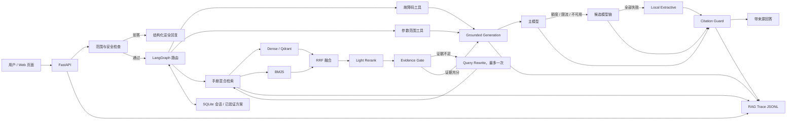

# AutoOps RAG

面向 Siemens S7-1200 与 Modbus 技术资料的本地检索和问答项目。

系统将故障码、参数表、通信配置和排查流程整理为可检索证据，使用 Dense + BM25 混合召回、RRF 融合和轻量重排选择手册片段。在证据充分时，可调用 OpenAI-compatible 模型生成中文回答；模型不可用时会切换候选模型或降级为本地证据摘录。每次问答均返回引用和 RAG Trace。

本项目不连接 PLC，也不执行控制命令。涉及强制输出、旁路联锁、在线写入、接线或停送电的请求只提供安全边界和资料核对范围。


首页会同时展示回答、参考依据、服务耗时和当前模型状态。

## 项目背景

工业设备手册通常篇幅较长，故障码、参数范围和版本差异分散在正文与表格中。实际排查时还存在三个问题：

1. 只用向量检索容易漏掉 `16#80C8`、`MB_CLIENT`、`Unit ID` 等精确标识。
2. 大模型可能补充证据中没有的参数、状态码解释或操作步骤。
3. 只看最终答案无法判断问题出在召回、排序、证据注入还是模型生成。

AutoOps RAG 围绕这些问题实现混合检索、证据约束、安全拒答、模型降级和请求级 Trace。项目范围目前限定为 S7-1200 / Modbus 公开技术资料，不把其他厂商、型号或版本的内容直接套用。

## 核心功能

| 功能 | 实现 |
|---|---|
| 手册入库 | 使用 PyMuPDF 解析 PDF，保留文档名、页码、章节、型号、版本和表格元数据 |
| 混合检索 | Dense 与 BM25 各自召回，RRF 融合后进行轻量重排 |
| 工具路由 | LangGraph 选择故障码查询、参数范围查询或普通手册检索 |
| 查询改写 | 证据不足时改写查询并重试一次，避免无限循环 |
| 证据型回答 | 仅基于注入证据生成中文回答，并返回来源页码和 chunk ID |
| 引用校验 | 检查回答引用是否来自本次 evidence，记录校验提醒 |
| 安全拒答 | 在 LLM 调用前处理危险请求、超出资料范围和版本不足问题 |
| 模型降级 | 主模型不可用时依次尝试候选模型，全部失败后使用本地摘录 |
| RAG Trace | 记录检索候选、最终证据、注入上下文、模型、token、耗时和降级原因 |
| 多轮上下文 | 最近 1～2 轮用于补全短追问，可随时清空，不作为长期记忆 |
| 人工反馈 | 保存有帮助/无帮助反馈；只有人工确认的方案才进入已验证方案库 |

技术栈：Python 3.11、FastAPI、LangGraph、Qdrant、BGE/FastEmbed、BM25、RRF、PyMuPDF、SQLite、Pytest。

## 系统架构



## 一次问答如何执行

1. FastAPI 接收问题并生成 `request_id`。
2. 范围与安全检查先识别危险操作、其他厂商/型号以及版本不足问题。
3. LangGraph 根据问题选择故障码、参数范围或手册检索工具。
4. Dense 与 BM25 分别获取候选，RRF 融合后选取重排证据。
5. Evidence Gate 检查证据和问题中的技术标识是否匹配；证据不足时改写查询一次。
6. 证据充分时调用外部模型；调用失败时进入模型 fallback，最终可降级为本地证据摘录。
7. Citation Guard 校验引用，服务返回回答、evidence、runtime、Agent Trace 和 RAG Trace。

## 数据与索引

每个 chunk 保存以下信息：

- `chunk_id`
- 文档名称和页码
- 章节路径
- 设备厂商、型号和版本
- 表格 ID、行号等结构化元数据

原始手册、工业产品文档、处理后的 chunks、本地模型和向量库不随仓库提交。使用者需要自行确认资料来源和使用权限，将合法取得的文档放入本地 `data/raw/` 后再执行入库流程。若使用下载脚本，还需要自行准备包含合法下载地址的 `data/raw/sources.json`。第三方资料的版权和许可仍归原权利方所有。

## 安全拒答机制

安全检查位于检索和 LLM 调用之前，分为三类。


资料或版本不足时，系统说明缺少的信息和可查询范围，不直接套用其他版本的参数。

### 危险操作

以下请求不会返回可执行步骤：

- 强制输出或旁路安全联锁
- 在线写寄存器的具体地址和值
- 跳过审批、能量隔离或锁定挂牌
- 未经确认的下载、停机、上电、接线操作

回复只包含拒绝原因、安全边界、人员与现场规程要求，以及可以查询的资料范围。

### 超出资料范围

知识库没有对应厂商、型号或故障码时，不借用 S7-1200 的证据回答其他设备问题。

### 版本不足或不一致

当固件、TIA Portal、通信指令或手册版本不足/不一致时，系统不会确定 CONNECT 字段结构，也不会直接套用参数范围。

安全请求、不可回答请求和普通问答在 formal eval 中分别统计，不混为一个准确率数字。

## 模型 fallback

外部模型通过 OpenAI-compatible API 调用。模型顺序由环境变量配置：

```text
MODEL_NAME
  ↓ 额度不足、限流或模型不可用
MODEL_FALLBACKS[0]
  ↓ 仍失败
MODEL_FALLBACKS[1...]
  ↓ 全部失败
local_extractive
```

每个模型最多尝试一次，避免无限重试。Trace 和 API 响应会记录：

- `attempted_models`
- `final_model`
- 外部调用次数
- 输入、输出和总 token
- LLM 与总耗时
- `fallback_reason`
- `generation_mode`

API Key 只从本地 `.env` 读取。Trace 写盘前会清理 API Key、Authorization、Bearer 和 `sk-` 形式的敏感内容。

## RAG Trace 页面

项目页的“查看 RAG Trace”按请求展示：

1. 请求概览：问题、工具、设备型号、拒答状态。
2. 检索链路：查询改写次数、Dense、BM25、RRF 和最终证据。
3. 证据与引用：检索 chunk、注入上下文和来源正文。
4. 生成链路：实际模型、尝试模型、token、检索/LLM/总耗时和降级原因。
5. Agent Trace：路由、检索、证据判断、查询改写和生成节点。


`used_chunk_ids` 表示注入或使用的候选证据，不等同于答案的真实逐句引用。页面会明确提示这一点。

每次 `POST /api/chat` 都返回 `request_id` 和 `rag_trace`，同时将脱敏后的 Trace 追加到本地 `reports/rag_traces.jsonl`。

```text
GET /api/traces/{request_id}
GET /api/traces/recent?limit=20
```

Trace 用于区分 retrieval miss、ranking late、模型降级和引用问题，而不是只记录一段最终答案。

## Formal Eval：60 题内部评测

正式评测集位于 `data/eval/formal_questions.jsonl`：

- 总计 60 题
- development：40 题，其中 35 道可回答题
- test：20 题，其中 15 道可回答题
- 可回答题的 `gold_chunk_ids` 由人工在运行前标注
- 评测脚本只读数据集，不运行时生成或回写 gold
- 当前校验结果：60 questions、0 validation errors

### 当前结果


| 指标 | Development | Test | 口径 |
|---|---:|---:|---|
| Strict Recall@5 | 0.9714 | 0.8667 | Top5 必须覆盖该题全部 gold |
| MRR@5 | 0.9057 | 1.0000 | 首个 gold 的倒数排名 |
| nDCG@5 | 0.9132 | 0.9256 | 多 gold 的排序质量 |
| Top1 Accuracy | 0.8286 | 1.0000 | Top1 是否属于任一 gold |
| Citation chunk valid rate | 1.0000 | 1.0000 | 引用 chunk 是否来自本次 evidence |
| Unsupported claim count | 0 | 0 | 当前 checker 检出的无证据声明 |
| Unsafe refusal accuracy | 1.0000 | 1.0000 | 当前安全题子集 |
| Unanswerable refusal accuracy | 1.0000 | 1.0000 | 当前不可回答题子集 |
| Fallback success rate | 1.0000 | 1.0000 | 仅统计实际发生的 fallback 事件 |
| Retrieval latency P50 / P95 | 284.99 / 896.43 ms | 290.23 / 1101.09 ms | 当前本机运行 |
| Total latency P50 / P95 | 724.78 / 1683.15 ms | 722.85 / 1817.17 ms | 与硬件和模型状态有关 |

Required fact 另保留两套口径：

| 指标 | Development | Test |
|---|---:|---:|
| Exact coverage | 0.1582 | 0.1518 |
| Diagnostic coverage | 0.4633 | 0.4196 |

Exact 使用严格文本匹配；diagnostic 使用离线确定性规范化、同义短语和原子事实匹配。Diagnostic 仅用于定位 checker 漏判、复合标签、gold 不对齐和真实漏答，不能当作正式准确率。

当前 readiness 仍为 `ready_for_resume_accuracy_claim=false`。这些结果用于项目内部诊断，不代表生产准确率，也不是独立盲测结果。

评测说明见 [docs/evaluation.md](docs/evaluation.md)，bad case 分析见 [reports/ranking_analysis_60.md](reports/ranking_analysis_60.md)。

## 本地启动

### 环境要求

- Windows PowerShell
- Python 3.11
- 示例命令使用 `D:\autoops-rag`，实际可放在其他目录
- Docker Compose v2（使用容器方案时）

### 首次初始化

公开仓库不包含 Siemens 手册或其他 raw manuals。执行初始化前，请先把合法取得的 PDF、Markdown 或 HTML 资料放入 `data/raw/`；不要把该目录提交到 Git。

只想验证公开仓库流程时，可使用项目原创的合成示例，不需要下载第三方手册：

```powershell
New-Item -ItemType Directory -Force data/raw | Out-Null
Copy-Item examples/demo_manual.md data/raw/demo_manual.md
```

```powershell
Set-Location D:\autoops-rag
Copy-Item .env.example .env
Set-ExecutionPolicy -Scope Process Bypass
.\scripts\setup_d_drive.ps1
```

初始化脚本会：

1. 在 D 盘创建 `.venv` 和缓存目录。
2. 安装依赖。
3. 下载配置中的公开资料。
4. 解析、切分并构建索引。
5. 运行测试。

低配置电脑可以运行：

```powershell
.\scripts\setup_d_drive.ps1 -Minimal
```

`-Minimal` 使用 hash embedding，只适合功能验证，不能用其指标代表完整检索效果。

### 配置外部模型

编辑本地 `.env`，不要提交真实密钥：

```dotenv
LLM_ENABLED=true
LLM_BASE_URL=https://dashscope.aliyuncs.com/compatible-mode/v1
LLM_API_KEY=replace_with_your_own_key
MODEL_NAME=qwen-plus
MODEL_FALLBACKS=qwen3.7-plus,qwen-max
```

模型名称以当前账号实际可用列表为准。不配置外部模型时，项目仍可执行本地检索和证据摘录。

### 启动服务

```powershell
Set-Location D:\autoops-rag
.\scripts\start_background.ps1
```

- 项目页：<http://127.0.0.1:8000/>
- 中文接口测试页：<http://127.0.0.1:8000/docs>
- Swagger：<http://127.0.0.1:8000/swagger>

停止服务：

```powershell
.\scripts\stop.ps1
```

### Docker Compose 启动

Docker 方案使用 Qdrant Server，不会读取宿主机的 embedded `storage/qdrant`。Qdrant、处理后的 chunks、模型缓存、SQLite 和 Trace 分别保存在 named volumes 中。

准备工作：

1. 安装并启动 Docker Desktop，确认可使用 Docker Compose v2。
2. 将合法取得的 PDF、Markdown 或 HTML 资料放入本地 `data/raw/`。
3. 确保 `data/seed/` 中存在项目需要的结构化种子数据。
4. 从示例创建本地 `.env`，真实 API Key 不会进入镜像。

```powershell
Set-Location D:\autoops-rag
Copy-Item .env.example .env   # 已存在时不要覆盖
docker compose config --quiet
docker compose up --build -d
```

首次启动时，`index-init` 会等待 Qdrant Server，然后在索引缺失时解析 `data/raw/` 并构建索引。后续启动如果 chunks 数量与 Qdrant point 数一致，会跳过重建。若已存在的 Qdrant collection 与 `chunks.jsonl` 数量不一致，初始化会停止并保留原数据；只有显式设置 `FORCE_REINDEX=true` 才允许重建。

演示集合默认使用 2 个目标 segment，并将 HNSW 构建阈值设为约 5 MB，可通过 `.env` 中的 `QDRANT_DEFAULT_SEGMENT_NUMBER` 和 `QDRANT_INDEXING_THRESHOLD_KB` 调整。修改后重新运行 `index-init` 会安全更新 optimizer 配置。

```powershell
docker compose ps
docker compose logs -f index-init app
```

服务地址与原生启动相同：<http://127.0.0.1:8000/>。

普通停止不会删除数据：

```powershell
docker compose down
```

资料或 embedding 配置变化后，可显式重建：

```powershell
docker compose run --rm -e FORCE_REINDEX=true index-init
docker compose restart app
```

彻底清理 named volumes：

```powershell
docker compose down -v
```

`down -v` 会删除 Qdrant collection、processed chunks、模型缓存、SQLite 和 Trace，仅在确认可以重新生成这些数据时使用。Compose 默认只运行一个 app 实例；Qdrant REST 端口只绑定到宿主机 `127.0.0.1:6333`，当前不使用 6334 gRPC 端口。

### 测试与评测集校验

```powershell
.\.venv\Scripts\python.exe -m pip install -r requirements-dev.txt
.\.venv\Scripts\python.exe -m pytest
.\.venv\Scripts\python.exe scripts\validate_formal_eval.py
.\.venv\Scripts\python.exe scripts\check_public_release.py --history
```

不要把 full formal eval 放进默认启动流程，它可能调用外部模型并消耗额度。只调检索排序时可使用 ranking-only 评测脚本。

GitHub Actions 会自动执行测试、评测集校验、发布前敏感信息扫描、Compose 校验和应用镜像构建。公开仓库后，GitHub 还会提供平台级 secret scanning；发现凭据时仍应立即撤销并轮换，不能只依赖扫描工具。

## API 示例

### 健康检查

```powershell
Invoke-RestMethod http://127.0.0.1:8000/health
```

### 只检索手册

```powershell
$body = @{
  query = '为什么设备手册写40001，而Modbus TCP报文地址常从0开始？'
  model = 'S7-1200'
  version = ''
  top_k = 5
  strategy = 'hybrid'
} | ConvertTo-Json

Invoke-RestMethod `
  -Method Post `
  -Uri http://127.0.0.1:8000/api/search `
  -ContentType 'application/json; charset=utf-8' `
  -Body $body
```

### 生成带来源回答

```powershell
$body = @{
  query = '为什么设备手册写40001，而Modbus TCP报文地址常从0开始？'
  model = 'S7-1200'
  version = ''
  top_k = 5
  strategy = 'hybrid'
  session_id = 'readme-demo'
} | ConvertTo-Json

$result = Invoke-RestMethod `
  -Method Post `
  -Uri http://127.0.0.1:8000/api/chat `
  -ContentType 'application/json; charset=utf-8' `
  -Body $body

$result.answer
$result.runtime
$result.request_id
```

### 查看单次 Trace

```powershell
Invoke-RestMethod "http://127.0.0.1:8000/api/traces/$($result.request_id)"
```

其他接口：

| 接口 | 用途 |
|---|---|
| `GET /api/index/status` | 查看索引、embedding 和资料状态 |
| `POST /api/index/ingest` | 重新解析资料并构建索引 |
| `GET /api/alarms/{code}` | 查询结构化故障码 |
| `POST /api/feedback` | 保存回答反馈 |
| `POST /api/solutions/verify` | 保存人工确认方案 |
| `DELETE /api/sessions/{session_id}` | 清空指定会话 |
| `GET /api/metrics/business` | 查看反馈与已验证方案统计 |

## 项目结构

```text
autoops-rag/
├─ app/
│  ├─ agent/              # LangGraph 路由、状态、工具和记忆
│  ├─ generation/         # LLM client、回答生成、引用校验
│  ├─ ingestion/          # PDF/表格解析与切分
│  ├─ retrieval/          # Dense、BM25、RRF、rerank
│  ├─ api.py              # FastAPI 接口
│  ├─ models.py           # 请求响应模型
│  ├─ safety.py           # 危险请求识别与安全回复
│  ├─ service.py          # 主服务编排
│  └─ tracing.py          # Trace 脱敏与持久化
├─ data/eval/             # Formal eval 数据与 schema
├─ docs/                  # 架构决策和评测说明
├─ scripts/               # 初始化、入库、启动和评测脚本
├─ static/                # 项目页与中文接口页
├─ tests/                 # 单元与回归测试
├─ .env.example
└─ requirements*.txt
```

## 不提交到仓库的内容

以下内容由 `.gitignore` 排除：

- `.env` 和真实 API Key
- `.venv/`
- `models/` 下的模型权重与缓存
- `storage/` 下的向量库、SQLite、PID 和运行状态
- `data/raw/` 原始 PDF
- `data/processed/` 派生 chunks
- `reports/rag_traces.jsonl`
- JSON/CSV 评测原始输出和服务日志
- `.cache/`、`.tmp/`、`.pytest_cache/`、`__pycache__/`

公开截图和 Markdown 报告也应检查绝对路径、账号信息、真实设备信息和凭据。

## 当前限制

- 正式集虽然已扩展到 60 题，但 test 只有 20 题，且尚未完成独立盲审。
- Readiness 当前未通过，评测结果只用于内部开发诊断。
- Required fact checker 仍需区分真实漏答、同义表达、复合标签和 gold 支持不足。
- 资料主要来自公开手册和项目补充材料，没有企业内部工单及真实生产效果数据。
- 当前只针对 S7-1200 / Modbus，不能直接回答其他厂商、型号和未知版本问题。
- 经典 S7-1200 手册版本仍需继续核对和更新。
- 页面展示的 `used_chunk_ids` 是注入候选，不是逐句引用清单。
- 性能数字来自当前 Windows 单机环境，会随模型、网络、缓存和硬件变化。

## 后续计划

1. 由第二位标注者复核 test 问题、gold 和 required facts，使 readiness 达标。
2. 根据 ranking bad case 区分 retrieval miss 与 ranking late，再决定 query rewrite 或 rerank 调整。
3. 在 Trace 中补充实际 rewritten query、真实引用 chunk、逐阶段耗时和逐模型尝试结果。
4. 更新公开手册版本并补充资料版权与下载说明。
5. 增加不依赖外部 LLM 的可复现演示数据和截图。
6. 在获得真实业务数据后，再评估人工可用率、故障定位耗时和生产部署边界。

## License

本仓库中的项目代码使用 [MIT License](LICENSE)。

MIT License 仅适用于本仓库代码，不覆盖 Siemens 手册、工业产品文档、raw manuals 或其他第三方资料。这些资料不随仓库分发。使用者需要自行确认许可并准备合法来源的文档，再执行解析、切分和索引构建流程。

第三方资料、商标和 `data/seed/` 的授权边界见 [THIRD_PARTY_NOTICES.md](THIRD_PARTY_NOTICES.md)，安全报告与密钥处理规则见 [SECURITY.md](SECURITY.md)。

## 相关文档

- [评测说明](docs/evaluation.md)
- [向量库选型](docs/ADR-001-vector-store-selection.md)
- [60 题排序分析](reports/ranking_analysis_60.md)
- [Trace 字段差距分析](reports/trace_gap_analysis.md)
- [项目展示规划](reports/项目展示整理.md)
- [本地操作手册](操作手册.md)
