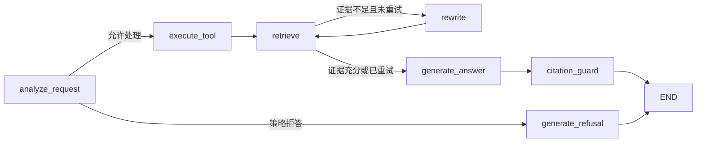

# LangGraph 工作流设计

AutoOps RAG 使用 LangGraph 表达**有界、可审计的 RAG 状态机**，不是依赖模型自由规划的自主 Agent。

## 节点与职责

| 节点 | 输入与决策 | 失败/回退 |
|---|---|---|
| `analyze_request` | 识别故障码、参数意图和设备版本，选择结构化工具或手册检索 | 危险操作、越界型号和版本不足在检索前短路 |
| `execute_tool` | 固定路由通过 Tool Registry 查询故障码或参数；普通 `search_manual` 延后执行；同时查询人工确认方案 | 结构化结果缺失或失败时仍进入手册检索，不直接编造答案 |
| `retrieve` | 通过同一 Tool Registry 执行一次 `search_manual`，复用 Dense + BM25 + RRF + rerank，并执行标识符证据检查 | 工具异常、超时或预算耗尽时结构化停止；普通证据不足进入一次有界 Query Rewrite |
| `rewrite` | 删除口语噪声并补充型号、版本和领域上下文 | 最多执行一次，避免无限循环与请求放大 |
| `generate_answer` | 证据充分时调用模型，否则使用本地证据摘录 | 模型配额、超时、空响应或格式失败时逐级降级 |
| `citation_guard` | 校验来源编号必须属于本次 evidence | 校验失败时强制切换为本地证据摘录 |
| `generate_refusal` | 生成结构化安全拒答 | 不执行检索和外部模型调用 |

## 为什么不使用普通 if-else

普通条件语句可以完成单次路由，但当前流程同时包含安全短路、工具执行、检索重试、模型降级和生成后校验。LangGraph 的价值是把这些控制边界显式化，并让每次状态转移进入 `agent_trace`；它不是为了把简单路由包装成“自主 Agent”。

## 有界性

- Query Rewrite 最多一次。
- 固定工具调用受 `max_tool_calls` 和单工具 timeout 约束；预算拒绝不会执行 handler。
- 每个外部模型按配置顺序尝试，禁止无限重试。
- 安全拒答发生在检索和模型调用之前。
- 引用校验失败后只允许确定性本地降级，不再触发第二轮自由生成。
