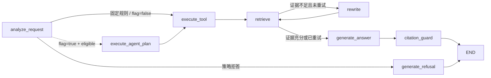

# LangGraph 工作流设计

AutoOps RAG 使用 LangGraph 表达**有界、可审计的 RAG 状态机**，不是依赖模型自由规划的自主 Agent。

```text
用户请求 -> analyze_request -> 工具注册中心（Tool Registry）-> 检索与证据判断
        -> LLM/本地摘要 -> 引用校验（Citation Guard）-> 返回结果
```

实现边界：固定节点和条件边始终是真实主干及 fallback。`ENABLE_AGENTIC_ROUTING=false` 时 Planner/Router 仍只记录候选；开启后，现有确定性 Bounded Query Planner 只对适用请求执行白名单计划。它不是 LLM Planner，也不是开放式工具循环。

## 节点与职责



| 节点 | 输入与决策 | 失败/回退 |
|---|---|---|
| `analyze_request` | 识别故障码、参数意图和设备版本，选择结构化工具或手册检索 | 危险操作、越界型号和版本不足在检索前短路 |
| `execute_agent_plan` | 对表格定位、跨章节流程和版本核对等适用请求执行严格 `Plan`；统一校验白名单、参数、budget、timeout 和调用签名 | 任一失败写入 `planner_fallback_reason` 并回到固定流程；成功结果可被后续节点安全复用 |
| `execute_tool` | 固定路由通过工具注册中心（Tool Registry）查询故障码或参数；普通 `search_manual` 延后执行；同时查询人工确认方案 | 结构化结果缺失或失败时仍进入手册检索，不直接编造答案 |
| `retrieve` | 通过同一 Tool Registry 执行一次 `search_manual`，复用 Dense + BM25 + RRF + Rerank，并执行证据充分性判断（Evidence Gate） | 工具异常、超时或预算耗尽时结构化停止；普通证据不足进入一次有界的问题改写（Query Rewrite） |
| `rewrite` | 删除口语噪声并补充型号、版本和领域上下文 | 最多执行一次，避免无限循环与请求放大 |
| `generate_answer` | 证据充分时调用 LLM，否则使用本地证据摘录 | 模型配额、超时、空响应或格式失败时使用降级机制（fallback） |
| `citation_guard` | 执行引用校验（Citation Guard），确认来源编号属于本次证据 | 校验失败时强制切换为本地证据摘录 |
| `generate_refusal` | 生成结构化安全拒答 | 不执行检索和外部模型调用 |

## 为什么不使用普通 if-else

普通条件语句可以完成单次路由，但当前流程同时包含安全短路、工具执行、检索重试、模型降级和生成后校验。LangGraph 的价值是把这些控制边界显式化，并让每次状态转移进入 `agent_trace`；它不是为了把简单路由包装成“自主 Agent”。

## 有界性

- Planner 实际参与时，Query Rewrite 受 `max_rewrites` 限制，并与 Planner 共用请求级轮数、工具次数和 Agent 检索/工具阶段的剩余时间预算；flag=false 且 Iterative Retrieval 关闭时仍保留旧固定路径的一次 Rewrite。
- 所有真实工具调用受 `max_tool_calls` 和单工具 timeout 约束；预算拒绝不会执行 handler。
- 相同 `canonical_tool_name + normalized arguments JSON` 在一个请求内只执行一次，重复步骤记录 `reused=true`、`deduplicated=true`。
- 受控 Planner 的可执行工具只来自 Tool Registry 当前 `agent_names`；动态注册的普通工具不会自动获得 Agent 执行权限。
- 每个外部模型按配置顺序尝试，禁止无限重试。
- 安全拒答发生在检索和模型调用之前。
- 引用校验失败后只允许确定性本地降级，不再触发第二轮自由生成。

## 规则优先与 fallback

Safety、Out-of-scope、明确故障码、明确参数查询和普通单步手册检索不进入真实 Planner。第一版受控 Planner 主要覆盖 `table_lookup`、`cross_section_procedure` 和 `version_resolution`。`lookup_fault_code`、`lookup_parameter` 的结构化结果只作为线索，不能绕过 Evidence Gate；`get_document_page` 只能读取已有 Evidence 明确提供的文档和页码。

计划校验失败、未知工具、非法参数、timeout、工具/轮数预算耗尽或 executor 异常都不会直接导致 500，而是回退固定流程。Registry 已经产出 `ToolResult` 后会先写入请求级恢复缓存，再执行 executor 后处理；即使后处理异常，fallback 也会复用相同签名结果，不会再次真实调用。`agent_timeout_seconds` 只约束受控工具和后续检索/改写是否继续，不是 LLM、Citation Guard 或 HTTP 全生命周期的硬 deadline。
