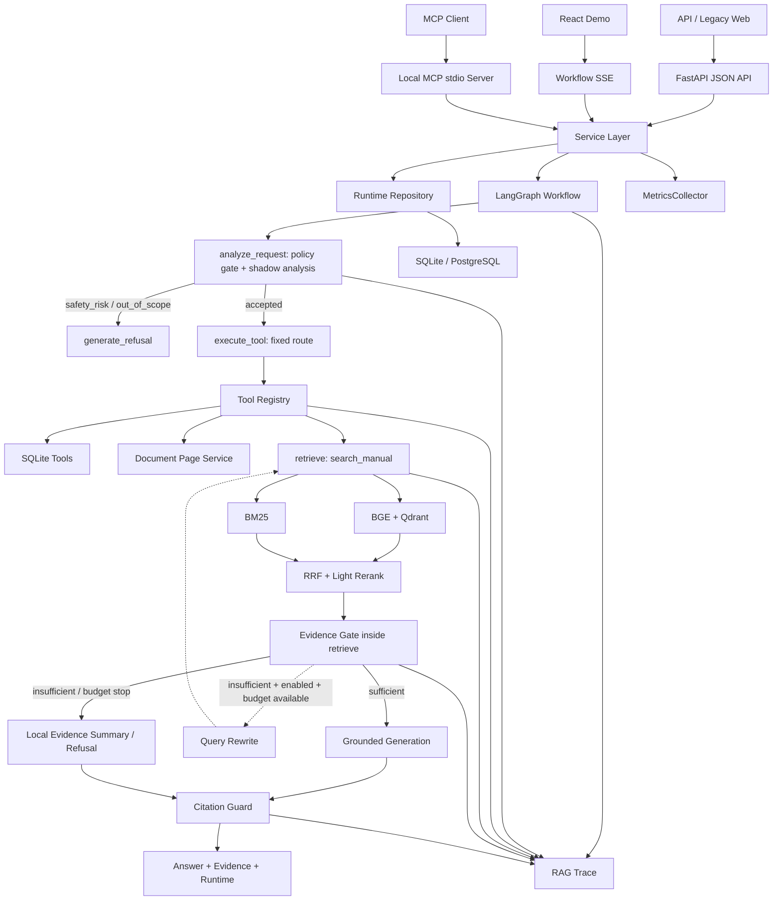

# AutoOps RAG 架构说明

## 架构定位

AutoOps RAG 是基于 LangGraph 的轻量级 Agentic RAG 工业知识库系统。真实问答由固定状态机控制；意图分类器（Intent Classifier）、工具路由器（Tool Router）和有界问题规划器（Bounded Query Planner）只在影子层（shadow layer）生成可观察的候选决策。实验性迭代检索必须显式开启，并受预算约束。

```text
用户请求 -> FastAPI -> Service -> LangGraph -> 工具注册中心（Tool Registry）-> RAG/工具
        -> LLM 或本地证据摘要 -> 引用校验（Citation Guard）-> 返回答案、证据和 Trace
```

实现状态必须分开理解：

- **已真实实现**：固定 LangGraph 主流程、Tool Registry 与四个工具、本地 MCP stdio Server、React Demo、工作流级 SSE、SQLite/PostgreSQL 数据访问层（Repository）、Trace 和运行指标。
- **shadow / experimental**：Intent Classifier、Tool Router、Bounded Query Planner 只记录候选决策；Iterative Retrieval 默认关闭。
- **尚未实现**：Planner 主动执行、开放式工具循环、远程 HTTP MCP、LLM Token Streaming，以及生产级多实例监控与运维能力。



## 核心模块职责

| 模块 | 它是干什么的 |
|---|---|
| FastAPI API 层 | 校验请求、生成 `request_id`，并提供 JSON、SSE、健康检查和指标接口。 |
| `AutoOpsService` | 连接 API、会话、LangGraph、Repository 与 Trace，并整理最终响应。 |
| LangGraph 工作流 | 用固定节点和条件边控制安全短路、工具、检索、改写、生成与引用校验。 |
| 工具注册中心（Tool Registry） | 登记四个正式工具，在统一入口完成参数校验、预算、超时、Trace 和指标结算。 |
| `HybridRetriever` | 执行 Dense、BM25、RRF 和 Rerank，返回带来源信息的手册证据。 |
| `AnswerGenerator` 与 Citation Guard | 基于证据生成回答，并检查引用编号是否属于本次证据。 |
| 数据访问层（Repository） | 用统一接口读写会话、反馈、人工确认方案、Trace metadata 和评测记录。 |
| 运行指标采集器（MetricsCollector） | 在当前进程内聚合请求、RAG、LLM、工具和延迟指标。 |
| MCP stdio Server | 把同一组 Tool Registry 能力暴露给本地 MCP Client，不复制业务逻辑。 |
| React Demo | 通过工作流级 SSE 展示执行阶段，最后显示完整答案、证据和 Trace。 |

## API 层

`app/api.py` 提供 FastAPI 接口，负责输入校验、请求编号、错误映射和响应模型：

- `POST /api/search`：只执行检索，不调用生成链路；
- `POST /api/chat`：执行完整问答状态机；
- `POST /api/chat/stream`：通过 SSE 推送工作流阶段事件，最终一次性返回完整回答；
- `GET /api/traces/{request_id}`：查询单次 Trace；
- `GET /api/traces/recent`：查询最近 Trace；
- `GET /metrics`、`GET /api/metrics/runtime`：分别返回 Prometheus 文本和运行指标 JSON；
- `/health/live`、`/health/ready`：进程和依赖就绪检查；
- 索引、反馈、人工确认方案和故障码等辅助接口。

API 层不决定 Agent 路由，核心编排交给 Service 和 LangGraph。

当前同时保留两套 Web 演示：FastAPI 继续托管原生 HTML/CSS/JavaScript 页面；`frontend/` 提供 React + TypeScript + Vite Demo，通过 `POST /api/chat/stream` 接收工作流级 SSE。当前 LLM 仍是非流式调用，SSE 只展示节点进度，最终答案在 `completed` 事件中一次性返回，不是 Token Streaming。

## Service 层

`app/service.py` 连接 API、会话上下文、MemoryStore、`ToolRegistry`、Retriever、`DocumentPageService`、Generator、Repository 和 TraceStore。它负责：

1. 解析短追问所需的有限会话上下文；
2. 调用 LangGraph 并汇总最终 state；
3. 构造 `ChatResponse`、运行统计和 `RagTraceResponse`；
4. 持久化脱敏 Trace，并把运行型 metadata 交给 Repository；
5. 暴露索引状态、反馈、人工确认方案和运行指标所需信息。

## LangGraph 工作流

`app/agent/graph.py` 将流程拆成显式节点：

```text
analyze_request
├─ [安全风险 / 超出范围] → generate_refusal → END
└─ [允许处理] → execute_tool
→ retrieve
→ [证据不足且允许重试] rewrite → retrieve（有界）
→ [证据充分或停止重试] generate_answer
→ citation_guard
→ END
```

安全风险或超出资料范围的请求由 `analyze_request` 内的策略判断在检索和模型调用前短路。Planner 不会动态添加节点或任意工具名，默认真实边仍是既有固定路径。故障码和参数分支在 `execute_tool` 节点调用 Registry；`search_manual` 延后到 `retrieve` 节点通过同一 Registry 执行，避免重复 Dense/BM25/RRF/Rerank。

## Hybrid Retrieval

`app/retrieval/` 实现：

- BGE/FastEmbed 生成向量，Qdrant 执行 Dense Retrieval；
- BM25 捕获故障码、参数名、端口号等精确词；
- RRF 合并 Dense 与 Sparse 排名；
- 轻量 Rerank 生成最终 TopK；
- 每个 `SearchHit` 保留 `chunk_id`、文档、页码、章节、型号、版本和检索分数。

该组合用于解决“语义相似”和“精确标识”同时存在的问题。

## 证据充分性判断（Evidence Gate）

Evidence Gate 位于生成之前，负责判断当前证据是否足以支撑回答，并输出结构化 assessment：

- `sufficient`、`reason`、`score`、`evidence_count`；
- `raw_missing_terms`、`filtered_missing_terms`、`generic_terms_ignored`；
- `retry_eligible`、`recommended_next_action`。

规则式过滤会忽略 `0`、`PLC`、手册、参数、故障等泛词，同时保留 `MB_CLIENT`、`16#80C8`、`ID`、`IP`、`PORT`、`502` 等有区分度标识。判断不调用 LLM，也不生成虚假 evidence score。

## 问题改写（Query Rewrite）

默认主流程保留原有一次 Query Rewrite，不形成开放循环。实验模式下，Query Rewrite 使用过滤后的缺失标识符构建补充查询，并重新走同一套 Hybrid Retrieval；没有另写检索系统。

## 引用校验（Citation Guard）

`app/generation/citation_guard.py` 检查回答中的引用是否对应本次 evidence。校验失败时不继续让模型自由修补，而是降级为本地证据摘要。`used_chunk_ids` 表示注入或使用的候选证据，不等同于逐句事实正确性。

## Trace

Trace 覆盖四类信息：

- 路由：`selected_tool`、intent、candidate plan、structured plan；
- 检索：Dense/BM25/RRF TopK、final evidence、rewritten queries、retrieval rounds；
- 控制：evidence assessments、tool calls、budget、stop reason；
- 生成：模型、降级机制（fallback）、Token、延迟、引用警告和最终 evidence；`first_token_latency_ms` 当前表示“响应可用耗时（当前不代表真实 TTFT）”，因为 LLM 不是 Token Streaming。

Trace 用于区分 retrieval miss、ranking late、证据不足、预算停止、模型降级和引用异常，不是简单日志拼接。

## Agentic 影子层（Shadow Layer）

### 意图分类器（Intent Classifier）

规则式分类八类 intent：故障诊断、参数、表格、跨章节流程、版本、普通手册、安全风险和越界。输出置信度、命中关键词和原因，不调用 LLM。

### 工具路由器（Tool Router）

根据 intent 生成候选工具序列，工具名必须来自白名单。当前默认只写入 Trace，不改变 `selected_tool`。

### 有界问题规划器（Bounded Query Planner）

生成最多 3 步的结构化计划，包含 `allow_generation`、`need_evidence_gate`、`max_rounds`、`max_tool_calls`、`routing_mode=shadow` 和 `applied=false`。安全和越界 intent 不生成工具步骤。

## 工具层（Tool Layer）

### 工具注册中心（Tool Registry）

`app/agent/tool_registry.py` 是四个正式工具的统一执行入口：它保留 `ToolRegistry` 类名和工具函数名原样，并统一完成 Pydantic 参数校验、工具预算、单工具超时、错误处理、`ToolCallTrace` 与工具指标结算。

### ToolResult

`app/models.py` 定义四个独立 Pydantic 输入模型，以及统一 `ToolResult` 和 `ToolCallTrace`。规范结果字段包括 `tool_name`、`success`、`data`、`result_count`、`error` 和 `latency_ms`；旧的 `tool`、`content`、`evidence`、`provenance`、`metadata` 字段继续兼容。真实固定 Graph 已使用该返回类型。

### SQLiteToolbox

`app/agent/tools.py` 封装：

- `lookup_fault_code`；
- `lookup_parameter`；
- `lookup_table_rows`。

查询复用 MemoryStore，用户输入始终作为参数传入，不生成 SQL、不执行写操作。结构化记录没有 `source/page/chunk_id` 时只能作为 metadata 或候选上下文，不能直接包装成最终可引用事实。

当前 Tool Registry 注册 `search_manual`、`lookup_fault_code`、`lookup_parameter` 和 `get_document_page`。故障码与参数工具复用 `SQLiteToolbox`，检索复用 `HybridRetriever.search_with_trace()`，文档页工具优先复用已处理 chunks。`lookup_table_rows` 仍只在独立测试和 shadow 候选计划中出现，不属于四个真实注册工具。

对外 `selected_tool` 暂时保留 `lookup_alarm_code` 和 `check_parameter_range` 旧值，以兼容现有 API、会话记录和评测数据；Graph State 的 `execution_tool` 与 ToolCallTrace 使用 `lookup_fault_code` 和 `lookup_parameter` 规范名称。

## 数据访问层（Repository）

`app/repositories/` 为会话、反馈、人工确认方案、Trace metadata 和评测记录提供统一读写接口。`ConversationRepository` 等类名保持原样；默认实现使用 SQLite，也可以通过 `DATABASE_BACKEND=postgres` 切换运行型数据到 PostgreSQL。Qdrant 和静态知识表不随之迁移。

## 运行指标采集器（MetricsCollector）

`app/metrics.py` 在当前进程内聚合 HTTP、RAG、检索、LLM 和工具指标，并通过 `/metrics` 与 `/api/metrics/runtime` 暴露结果。P50/P95/P99 使用最近最多 1000 个样本的滚动窗口，不是全生命周期分位数；多 worker 和独立 MCP 进程的指标不会自动合并。

## MCP 与 Web 入口

- `app/mcp/server.py` 是本地 MCP stdio 协议适配层，复用 Service 与 Tool Registry；它没有实现远程 HTTP MCP、认证、TLS 或多租户隔离。
- `frontend/` 是 React + TypeScript Demo，通过工作流级 SSE 展示阶段事件；当前不是 LLM Token Streaming。
- `static/` 是继续保留的原生 HTML/CSS/JavaScript 页面，不需要 React 构建即可使用。

## Iterative Retrieval

### 默认关闭

`ENABLE_ITERATIVE_RETRIEVAL=false`。关闭时不引入新增循环，也不改变 `/api/chat`、`/api/search` 的默认路径。

### 开关与条件

开启后必须同时满足：证据不足、assessment 建议重试、存在有效缺失标识符、非安全/越界请求、预算未耗尽且未超时。

### Budget 控制

```text
max_agent_rounds = 2
max_tool_calls = 4
max_llm_calls = 2
agent_timeout_seconds = 60
max_rewrites = 1
```

Registry 在每次真实工具执行前强制检查 `max_tool_calls`，被预算拒绝的调用会生成 `executed=false` 的 ToolCallTrace，但不会执行 handler，也不会增加已执行工具数。每个工具还受 `TOOL_TIMEOUT_SECONDS` 约束。现有 agent budget snapshot 复用这些 Trace 统计，并继续判断实验性迭代检索是否还能重试。

### Stop Reason

可能的停止原因包括：

- `evidence_sufficient`；
- `generic_terms_only`；
- `max_rounds_reached`；
- `max_rewrites_reached`；
- `max_tool_calls_reached`；
- `timeout_reached`；
- `safety_blocked`；
- `out_of_scope`；
- `insufficient_evidence`。

这套机制的目标是可解释地停止，而不是让 Agent 持续“再试一次”。
