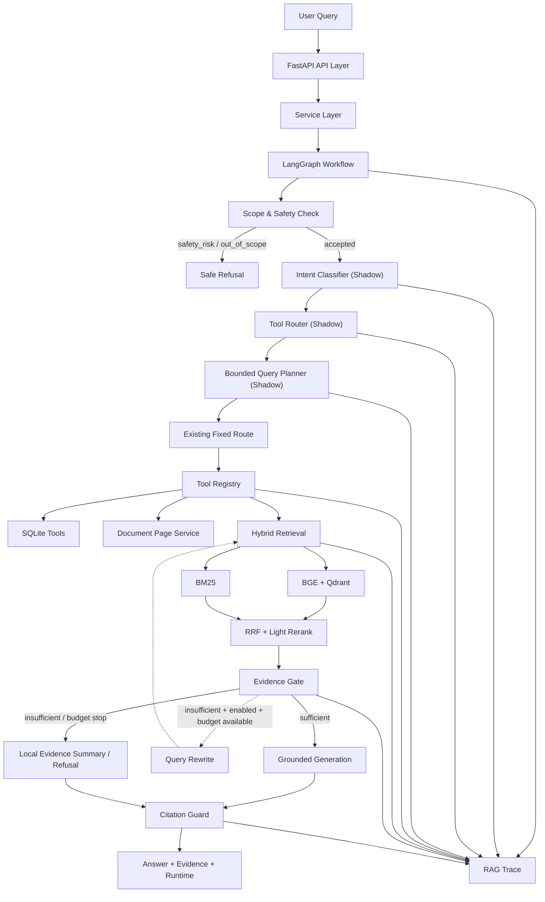

# AutoOps RAG 架构说明

## 架构定位

AutoOps RAG 是基于 LangGraph 的轻量级 Agentic RAG 工业知识库系统。真实问答由固定状态机控制；Intent Classifier、Tool Router 和 Bounded Query Planner 主要在 shadow layer 中生成可观察的候选决策。实验性迭代检索必须显式开启，并受预算约束。



## API 层

`app/api.py` 提供 FastAPI 接口，负责输入校验、请求编号、错误映射和响应模型：

- `POST /api/search`：只执行检索，不调用生成链路；
- `POST /api/chat`：执行完整问答状态机；
- `GET /api/traces/{request_id}`：查询单次 Trace；
- `GET /api/traces/recent`：查询最近 Trace；
- `/health/live`、`/health/ready`：进程和依赖就绪检查；
- 索引、反馈、人工确认方案和故障码等辅助接口。

API 层不决定 Agent 路由，核心编排交给 Service 和 LangGraph。

当前 Web 演示由 FastAPI 直接托管 `static/index.html` 和 `static/docs.html`，技术实现是原生 HTML、CSS 和 JavaScript。页面通过普通 `fetch` 等待完整 JSON 响应后展示回答、Evidence 和 Trace；当前没有 React/TypeScript 前端工程，也没有 SSE 或 token Streaming API。

## Service 层

`app/service.py` 连接 API、会话上下文、MemoryStore、ToolRegistry、Retriever、DocumentPageService、Generator 和 TraceStore。它负责：

1. 解析短追问所需的有限会话上下文；
2. 调用 LangGraph 并汇总最终 state；
3. 构造 `ChatResponse`、运行统计和 `RagTraceResponse`；
4. 持久化脱敏 Trace；
5. 暴露索引状态、反馈和人工确认方案能力。

## LangGraph 工作流

`app/agent/graph.py` 将流程拆成显式节点：

```text
analyze_request
→ scope_and_safety_gate
→ execute_tool
→ retrieve
→ evidence_gate
→ [rewrite → retrieve]（有界）
→ generate_answer
→ citation_guard
→ END
```

Safety/out-of-scope 请求在检索和模型调用前短路。Planner 不会动态添加节点或任意工具名，默认真实边仍是既有固定路径。故障码和参数分支在 `execute_tool` 节点调用 Registry；`search_manual` 延后到 `retrieve` 节点通过同一 Registry 执行，避免重复 Dense/BM25/RRF/rerank。

## Hybrid Retrieval

`app/retrieval/` 实现：

- BGE/FastEmbed 生成向量，Qdrant 执行 Dense Retrieval；
- BM25 捕获故障码、参数名、端口号等精确词；
- RRF 合并 Dense 与 Sparse 排名；
- 轻量 rerank 生成最终 TopK；
- 每个 `SearchHit` 保留 `chunk_id`、文档、页码、章节、型号、版本和检索分数。

该组合用于解决“语义相似”和“精确标识”同时存在的问题。

## Evidence Gate

Evidence Gate 位于生成之前，输出结构化 assessment：

- `sufficient`、`reason`、`score`、`evidence_count`；
- `raw_missing_terms`、`filtered_missing_terms`、`generic_terms_ignored`；
- `retry_eligible`、`recommended_next_action`。

规则式过滤会忽略 `0`、`PLC`、手册、参数、故障等泛词，同时保留 `MB_CLIENT`、`16#80C8`、`ID`、`IP`、`PORT`、`502` 等有区分度标识。判断不调用 LLM，也不生成虚假 evidence score。

## Query Rewrite

默认主流程保留原有一次 Rewrite，不形成开放循环。实验模式下，Rewrite 使用过滤后的缺失标识符构建补充查询，并重新走同一套 Hybrid Retrieval；没有另写检索系统。

## Citation Guard

`app/generation/citation_guard.py` 检查回答中的引用是否对应本次 evidence。校验失败时不继续让模型自由修补，而是降级为本地证据摘要。`used_chunk_ids` 表示注入或使用的候选证据，不等同于逐句事实正确性。

## Trace

Trace 覆盖四类信息：

- 路由：`selected_tool`、intent、candidate plan、structured plan；
- 检索：Dense/BM25/RRF TopK、final evidence、rewritten queries、retrieval rounds；
- 控制：evidence assessments、tool calls、budget、stop reason；
- 生成：模型、fallback、token、延迟、引用警告和最终 evidence。

Trace 用于区分 retrieval miss、ranking late、证据不足、预算停止、模型降级和引用异常，不是简单日志拼接。

## Agentic Shadow Layer

### Intent Classifier

规则式分类八类 intent：故障诊断、参数、表格、跨章节流程、版本、普通手册、安全风险和越界。输出置信度、命中关键词和原因，不调用 LLM。

### Tool Router

根据 intent 生成候选工具序列，工具名必须来自白名单。当前默认只写入 Trace，不改变 `selected_tool`。

### Bounded Query Planner

生成最多 3 步的结构化计划，包含 `allow_generation`、`need_evidence_gate`、`max_rounds`、`max_tool_calls`、`routing_mode=shadow` 和 `applied=false`。安全和越界 intent 不生成工具步骤。

## Tool Layer

### ToolResult

`app/models.py` 定义四个独立 Pydantic 输入模型，以及统一 `ToolResult` 和 `ToolCallTrace`。规范结果字段包括 `tool_name`、`success`、`data`、`result_count`、`error` 和 `latency_ms`；旧的 `tool`、`content`、`evidence`、`provenance`、`metadata` 字段继续兼容。真实固定 Graph 已使用该返回类型。

### SQLiteToolbox

`app/agent/tools.py` 封装：

- `lookup_fault_code`；
- `lookup_parameter`；
- `lookup_table_rows`。

查询复用 MemoryStore，用户输入始终作为参数传入，不生成 SQL、不执行写操作。结构化记录没有 `source/page/chunk_id` 时只能作为 metadata 或候选上下文，不能直接包装成最终可引用事实。

当前 Registry 注册 `search_manual`、`lookup_fault_code`、`lookup_parameter` 和 `get_document_page`。故障码与参数工具复用 `SQLiteToolbox`，检索复用 `HybridRetriever.search_with_trace()`，文档页工具优先复用已处理 chunks。`lookup_table_rows` 仍只在独立测试和 shadow 候选计划中出现，不属于本阶段四个真实注册工具。

对外 `selected_tool` 暂时保留 `lookup_alarm_code` 和 `check_parameter_range` 旧值，以兼容现有 API、会话记录和评测数据；Graph State 的 `execution_tool` 与 ToolCallTrace 使用 `lookup_fault_code` 和 `lookup_parameter` 规范名称。

## Iterative Retrieval

### 默认关闭

`ENABLE_ITERATIVE_RETRIEVAL=false`。关闭时不引入新增循环，也不改变 `/api/chat`、`/api/search` 的默认路径。

### 开关与条件

开启后必须同时满足：证据不足、assessment 建议重试、存在有效缺失标识符、非安全/越界请求、预算未耗尽且未超时。

### Budget 控制

```text
max_agent_rounds = 2
max_tool_calls = 4
max_llm_calls = 2
agent_timeout_seconds = 60
max_rewrites = 1
```

Registry 在每次真实工具执行前强制检查 `max_tool_calls`，被预算拒绝的调用会生成 `executed=false` 的 ToolCallTrace，但不会执行 handler，也不会增加已执行工具数。每个工具还受 `TOOL_TIMEOUT_SECONDS` 约束。现有 agent budget snapshot 复用这些 Trace 统计，并继续判断实验性迭代检索是否还能重试。

### Stop Reason

可能的停止原因包括：

- `evidence_sufficient`；
- `generic_terms_only`；
- `max_rounds_reached`；
- `max_rewrites_reached`；
- `max_tool_calls_reached`；
- `timeout_reached`；
- `safety_blocked`；
- `out_of_scope`；
- `insufficient_evidence`。

这套机制的目标是可解释地停止，而不是让 Agent 持续“再试一次”。
