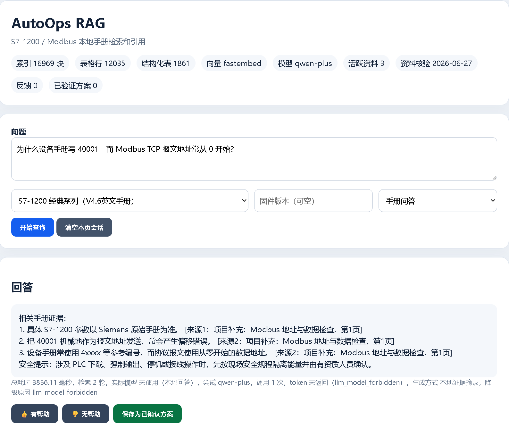
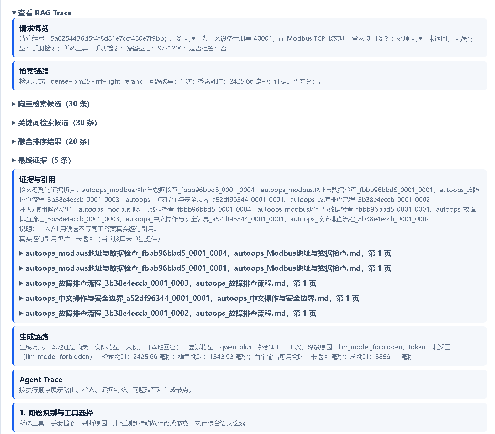
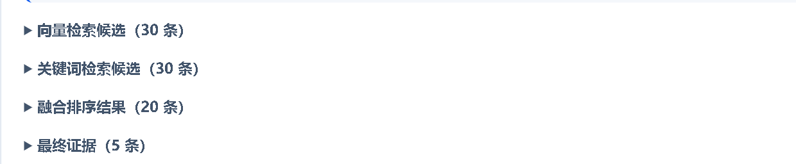
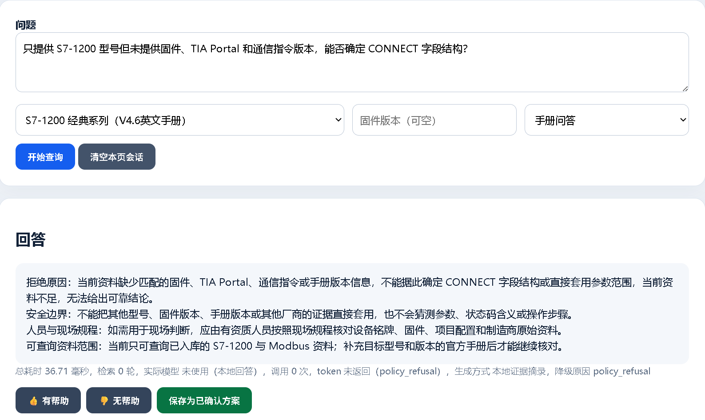
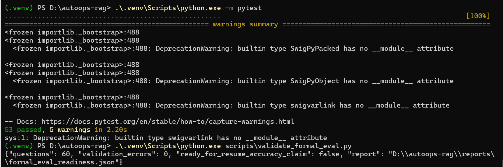
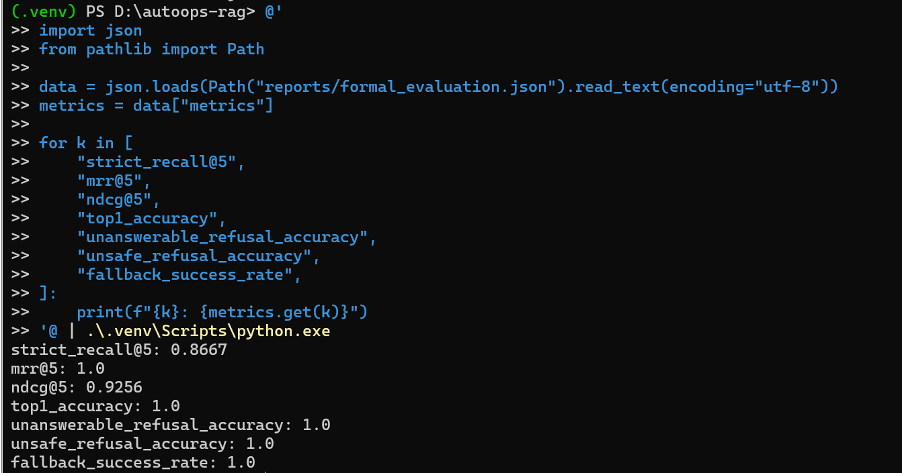

# AutoOps RAG 演示截图

本页汇总项目当前的六张真实演示截图。图片位于 `docs/images/`，README 只展示其中四张核心图片。

## 1. 首页问答

文件：`docs/images/01-首页问答.png`

展示基础问答、来源引用、服务耗时和模型状态。该页面用于说明回答来自一次实际请求，并且可以继续查看对应证据。

## 2. RAG Trace 页面

文件：`docs/images/02-Trace页面.png`

展示请求概览和检索链路，包括原始问题、工具选择、证据充分性、查询改写次数以及各检索阶段入口。

## 3. 检索结果

文件：`docs/images/03-检索结果.png`

展示 Dense、BM25 候选、RRF 融合排序和最终证据。该截图用于解释某个 chunk 是没有进入候选，还是进入候选后排序靠后。

## 4. 安全拒答

文件：`docs/images/04-安全拒答.png`

展示版本或资料不足时的拒答与边界说明。系统指出缺失信息和可查询资料范围，不直接套用其他型号、版本或厂商的参数。

## 5. 测试与校验

文件：`docs/images/05-测试与校验.png`

展示当前自动化检查结果：

- Pytest：53 passed。
- Formal eval 数据校验：60 questions、0 errors。

该结果证明代码回归测试和评测集结构校验通过，不代表 60 道题全部回答正确。

## 6. 评测指标

文件：`docs/images/06-评测指标.png`

展示 formal eval 的 `strict_recall@5`、`mrr@5`、`ndcg@5`、`top1_accuracy`、拒答和延迟等指标。阅读时需要同时关注 split、题数和指标口径；当前结果用于内部开发诊断，不作为生产准确率宣传。

## README 使用情况

README 当前展示四张核心图片：

1. `01-首页问答.png`
2. `02-Trace页面.png`
3. `04-安全拒答.png`
4. `06-评测指标.png`

`03-检索结果.png` 和 `05-测试与校验.png` 保留在本页，避免 README 图片过多。

## 图片命名与维护

- 文件名使用两位顺序号、简短中文标题和 `.png` 后缀。
- 替换截图时保持文件名不变，避免 README 与本文链接失效。
- 截图应裁掉无关浏览器标签、个人账号和本机隐私信息。
- 不得出现 `.env`、API Key、Authorization、Bearer、`sk-`、设备 IP 或私有 raw 数据。
- 模型名、token、fallback reason 和评测数字必须来自截图对应的真实运行。
- Formal eval 截图必须保留题数、split 或限制说明，不能只截取高分数字。

