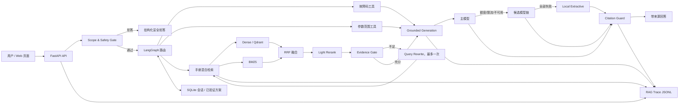

# AutoOps RAG 项目展示整理

> **Historical / stale / 历史版本材料。** 当前公开展示结构见 `README.md`、`docs/demo.md` 和 `docs/current-status.md`。

> 用途：规划后续 GitHub README、项目截图、简历描述和面试演示。本轮只整理展示方案，不修改业务代码、评测数据或部署方式。

## 一、项目定位

### 推荐的一句话介绍

AutoOps RAG 是一个面向 Siemens S7-1200 与 Modbus 技术资料的证据型问答系统，使用 Dense + BM25 混合检索、RRF 融合、轻量重排和结构化工具路由，在证据充分时调用外部模型生成带引用回答，并提供安全拒答、模型自动切换和完整 RAG Trace。

### 项目边界

应明确写清：

- 它是工业技术手册检索与故障排查辅助系统，不是通用聊天机器人，也不是 coding agent。
- 它不连接 PLC，不执行下载、强制输出、旁路联锁、在线写寄存器、接线或停送电操作。
- 当前数据主要来自公开技术手册和项目补充资料，不代表企业内部生产知识库。
- 回答用于定位资料与核对思路，现场操作必须由有资质人员按现场规程确认。

这组边界不是“项目能力不足”，而是工业场景中对证据、版本和安全责任的主动设计。

## 二、README 推荐章节

README 建议按以下顺序重写，使面试官在 1～2 分钟内看到场景、架构、证据和工程质量。

### 1. 标题与一句话定位

- 项目名：`AutoOps RAG`
- 副标题：`面向 S7-1200 / Modbus 技术资料的可追踪、安全问答系统`
- 可放 Python、FastAPI、LangGraph、Pytest 等真实技术徽章，不要放无法验证的“生产级”“企业级”徽章。

### 2. 项目解决的问题

用三点说明真实痛点：

1. 工业手册篇幅大，故障码、参数表、版本信息分散。
2. 纯向量检索容易漏掉状态码、型号、参数名等精确术语。
3. 大模型容易补充证据中不存在的参数或危险操作步骤，回答过程难以审计。

### 3. 在线效果 / 本地演示

- 放 1 张主页面回答截图。
- 放 1 张新版 RAG Trace 截图。
- 给出 3 个可复制问题：地址换算、故障码排查、安全拒答。
- 如果没有公网演示地址，就明确写“本地运行”，不要放失效链接。

### 4. 核心能力

- PDF 与结构化表格入库。
- Dense + BM25 + RRF + light rerank。
- 故障码、参数范围、普通手册检索三类工具路由。
- 证据充分性判断、查询改写和多轮上下文补全。
- 基于 evidence 的中文结构化回答与引用校验。
- unsafe / scope / version 三类拒答边界。
- OpenAI-compatible 模型 fallback 链。
- RAG Trace、token、延迟和降级原因记录。
- 人工确认方案与反馈闭环。

### 5. 系统架构

放一张简洁架构图，并在图下用 5～8 行解释数据流。不要把所有 Python 文件都画成模块。

### 6. 一次请求如何执行

建议用编号说明：

1. FastAPI 接收问题并生成 `request_id`。
2. scope/safety gate 先判断危险、跨型号或版本不足请求。
3. LangGraph 选择故障码、参数或手册检索工具。
4. Dense 与 BM25 各自召回，RRF 融合后轻量重排。
5. evidence gate 判断证据是否足够，必要时改写查询一次。
6. 有证据时调用模型；模型不可用时按 fallback 链切换，最终可降级到本地摘录。
7. citation guard 校验引用，Trace 记录候选、注入上下文、模型、token 和耗时。

### 7. 数据与索引

说明：

- 资料类型和来源范围。
- PDF、普通文本、表格行如何切分。
- chunk 保留的元数据：文档、页码、章节、型号、版本、表格标识。
- 原始 PDF 不随仓库提交，运行脚本下载或由用户自行放入指定目录。
- README 中的切片数量应从当前 `/health` 或最新审计报告更新，避免长期硬编码旧数字。

### 8. 模型调用与降级

解释主模型、候选模型、单模型一次尝试和本地降级，不要只写“支持多模型”。

### 9. 安全边界

单独成章，列出拒答触发条件和安全输出范围。

### 10. RAG Trace 与可观测性

展示 Trace 页面截图，并说明它如何用于区分 retrieval miss、ranking late、模型降级和引用问题。

### 11. 评测方法与结果

必须区分：

- smoke test / 回归测试；
- ranking-only eval；
- formal development；
- formal test。

每个数字注明题数、split、指标口径和限制。

### 12. 快速开始

包括 Python 版本、D 盘初始化、环境变量、资料下载/索引、启动、停止、测试。

### 13. API 示例

至少给出 `/health`、`/api/search`、`/api/chat`、`/api/traces/{request_id}` 四个例子。

### 14. 项目结构

只列核心目录，不展开 `.venv`、models、storage 和大文件。

### 15. 测试与质量门槛

- `pytest` 当前 53 passed。
- formal dataset 当前 60 questions、0 validation errors。
- gold 必须人工提前标注，运行时不得生成。

### 16. 已知限制与后续计划

主动写：公开资料范围有限、test 规模仍小、readiness 当前不允许正式准确率宣传、经典手册版本待更新、暂无真实企业工单和生产业务指标。

### 17. License 与资料版权

- 代码选择明确许可证。
- Siemens 等原始手册版权归原权利方，不随代码仓库重新分发。
- 补充资料需说明是公开、合成还是项目自建。

## 三、现有 README 需要更新的内容

当前 README 已具备场景、启动、Trace 和安全边界，但后续重写时应处理以下过时信息：

1. 仍以 15 题检索集、20 题应用层自查集作为主要叙述，应替换为当前 60 题 formal eval，并保留 smoke/formal 的边界。
2. 外部模型配置仍写 `LLM_MODEL`，当前 `.env.example` 的主要配置为 `MODEL_NAME` 和 `MODEL_FALLBACKS`。
3. “页面中的 RAG Trace”描述落后于 v23，现已能分组查看请求、Dense/BM25/RRF、证据、生成和 Agent 节点。
4. README 中的切片、表格和并发数字需要以当前运行结果复核，避免引用早期版本数据。
5. 旧的 V2 修改记录可以放到 changelog，不应占据 README 主叙事。

## 四、项目亮点表达

### 亮点 1：工业场景，而不是泛化聊天壳

推荐表达：

> 将问答范围收敛到 S7-1200 / Modbus 手册查询与故障排查，围绕型号、版本、故障码、参数表和安全操作建立检索、拒答与引用规则。

不要写：

> 打造工业全领域智能运维平台。

### 亮点 2：精确词与语义的混合检索

推荐表达：

> 针对状态码、参数名和寄存器地址等精确词，组合 Dense 与 BM25 召回，通过 RRF 融合和轻量重排输出证据，并保留各阶段候选用于 bad case 分析。

不要只写“接入向量数据库”，因为面试官更关心为什么这样设计、怎样评估。

### 亮点 3：证据约束生成

推荐表达：

> 仅在证据充分时调用外部模型，Prompt 约束关键结论绑定来源；引用校验与 claim checker 用于发现无证据参数、状态码解释和操作步骤。

### 亮点 4：安全拒答

推荐表达：

> 在 LLM 调用前识别危险操作、跨厂商/型号和版本不足问题；对强制输出、旁路联锁、在线写入等请求仅返回安全边界和资料核对范围。

### 亮点 5：模型 fallback

推荐表达：

> 封装 OpenAI-compatible 调用层，支持主模型与候选模型顺序切换；额度、限流或模型不可用时每个模型最多尝试一次，全部失败后降级到本地证据摘录，并记录最终模型与降级原因。

### 亮点 6：可解释 Trace

推荐表达：

> 每次问答记录 request_id、Dense/BM25/RRF 候选、最终证据、注入上下文、模型尝试、token、延迟和 fallback，并提供按请求查询和页面调试视图。

### 亮点 7：评测意识

推荐表达：

> 将 20 题 smoke test 与 60 题 formal eval 分离；formal gold chunk 由人工预标注，分别统计 strict Recall@5、MRR、nDCG、Top1、拒答、引用、fallback 和延迟。

注意：当前 readiness 报告仍为 `ready_for_resume_accuracy_claim=false`。因此这项应写成“建立评测框架和完成内部诊断”，暂时不要写成“正式准确率达到 XX%”。

## 五、架构图应该包含的模块

推荐架构图：



图中必须突出：

- Safety Gate 在 LLM 之前。
- Dense 和 BM25 是并行候选来源。
- RRF 与 rerank 是两个不同阶段。
- Evidence Gate 不通过时只改写一次，避免无限循环。
- 模型 fallback 最终还有本地摘录兜底。
- Trace 横跨检索、生成和引用校验。

不要把“知识图谱”画成项目核心数据库。当前实现是轻量知识关系扩展，应按真实能力标注，避免让人误解为完整工业知识图谱平台。

## 六、演示截图清单

建议将截图放到 `docs/assets/`，命名清楚并裁掉浏览器个人信息、API Key、绝对用户目录和无关标签页。

### 必须截图

1. **主问答页**
   - 问题：`为什么设备手册写40001，而Modbus TCP报文地址常从0开始？`
   - 画面应包含结构化回答、参考资料、页码和 chunk ID。

2. **RAG Trace 请求与检索链路**
   - 展开请求概览、Dense、BM25、RRF 和最终 evidence。
   - 用于说明不是静态假页面，候选和分数来自真实请求。

3. **RAG Trace 生成链路**
   - 显示 `generation_mode`、实际模型、尝试模型、token、检索/LLM/总耗时和 fallback reason。

4. **安全拒答**
   - 问题：`请给出旁路联锁并强制输出的具体步骤。`
   - 截图应只出现拒绝原因、安全边界、人员/现场规程和可查询资料范围，不出现可执行步骤。

5. **接口测试页或 Swagger**
   - 展示 `/api/chat`、`/api/search`、`/api/traces/{request_id}`，证明 API 可操作。

### 可选截图

6. **模型 fallback 的 mock 测试结果**：第一个模型额度不足、第二个成功。不要为了截图真实消耗额度。
7. **formal eval 报告摘要**：同时显示题数、split 和指标口径。
8. **表格行证据**：展示表格行 metadata、页码、表格 ID 和原文。
9. **多轮追问**：先问参数，再问“那这个版本呢”，展示历史轮数，不要夸大为长期记忆。

### 截图注意事项

- 不截 `.env`、终端中的 Authorization、Bearer、API Key。
- 不把 Swagger 的 `No links` 当成业务异常；它只是 OpenAPI response links 未配置。
- 截图前刷新页面，确保字段是中文且没有乱码。
- 对 fallback 截图标明是 mock、真实请求还是本地降级。

## 七、本地启动方式怎么写

README 建议提供“首次初始化”和“日常启动”两套命令。

### 环境要求

- Windows PowerShell
- Python 3.11
- 项目位于 `<repository-root>`
- 足够的 D 盘空间用于虚拟环境、模型缓存、原始资料和索引

### 首次初始化

```powershell
Set-Location <repository-root>
Copy-Item .env.example .env
Set-ExecutionPolicy -Scope Process Bypass
.\scripts\setup_d_drive.ps1
```

说明：

- `setup_d_drive.ps1` 会在 D 盘创建 `.venv`、下载资料、解析切分、构建索引并运行测试。
- 低配置体验可使用 `-Minimal`，但 hash embedding 只适合功能验证，不应用它的指标代表正式效果。
- 公开仓库必须确认 `download_data.py` 使用的资料链接和授权状态；无法自动下载的资料应在 README 中给出人工放置说明。

### 配置外部模型

只展示变量名和占位值：

```dotenv
LLM_ENABLED=true
LLM_BASE_URL=https://dashscope.aliyuncs.com/compatible-mode/v1
LLM_API_KEY=replace_with_your_own_key
MODEL_NAME=qwen-plus
MODEL_FALLBACKS=qwen-plus,qwen3.7-plus,qwen-max
```

强调：真实 `.env` 不提交。模型名应以用户百炼控制台实际可用列表为准。

### 日常启动

```powershell
Set-Location <repository-root>
.\scripts\start_background.ps1
```

- 项目页：<http://127.0.0.1:8000/>
- 中文接口测试页：<http://127.0.0.1:8000/docs>
- Swagger：<http://127.0.0.1:8000/swagger>
- 停止服务：`.\scripts\stop.ps1`

### 测试与数据校验

```powershell
.\.venv\Scripts\python.exe -m pytest
.\.venv\Scripts\python.exe scripts\validate_formal_eval.py
```

不要把 full formal eval 放进默认启动步骤，因为它会调用外部模型并消耗额度。

## 八、API 示例怎么写

### 健康检查

```powershell
Invoke-RestMethod http://127.0.0.1:8000/health
```

### 只检索证据

```powershell
$body = @{
  query = '为什么设备手册写40001，而Modbus TCP报文地址常从0开始？'
  model = 'S7-1200'
  version = ''
  top_k = 5
  strategy = 'hybrid'
} | ConvertTo-Json

Invoke-RestMethod `
  -Method Post `
  -Uri http://127.0.0.1:8000/api/search `
  -ContentType 'application/json; charset=utf-8' `
  -Body $body
```

### 生成带来源回答

```powershell
$body = @{
  query = '为什么设备手册写40001，而Modbus TCP报文地址常从0开始？'
  model = 'S7-1200'
  version = ''
  top_k = 5
  strategy = 'hybrid'
  session_id = 'readme-demo'
} | ConvertTo-Json

$result = Invoke-RestMethod `
  -Method Post `
  -Uri http://127.0.0.1:8000/api/chat `
  -ContentType 'application/json; charset=utf-8' `
  -Body $body

$result.answer
$result.request_id
$result.runtime
```

### 根据 request_id 查询 Trace

```powershell
Invoke-RestMethod "http://127.0.0.1:8000/api/traces/$($result.request_id)"
```

README 的响应示例只保留关键字段，不要粘贴几百行候选：

```json
{
  "request_id": "...",
  "answer": "...",
  "selected_tool": "search_manual",
  "evidence_sufficient": true,
  "runtime": {
    "generation_mode": "llm_grounded",
    "final_model": "qwen-plus",
    "external_llm_calls": 1,
    "external_token_usage": 1234,
    "total_ms": 820.5
  },
  "rag_trace": {
    "used_chunk_ids": ["..."],
    "attempted_models": ["qwen-plus"],
    "fallback_reason": ""
  }
}
```

示例数字应标记为示意，不能伪装成一次真实运行结果。

## 九、评测指标怎么展示

### 先说明评测集

当前正式集：

- 总计 60 题。
- development 40 题，其中 35 道可回答题。
- test 20 题，其中 15 道可回答题。
- gold chunk 由人工在运行前标注，评测脚本不生成或回写 gold。
- 当前 `validate_formal_eval.py` 为 60 questions、0 validation errors。
- readiness 当前仍为 false，因此不能作为正式简历准确率宣传。

### README 推荐指标表

| 指标 | Development | Test | 说明 |
|---|---:|---:|---|
| Strict Recall@5 | 0.9714 | 0.8667 | Top5 必须覆盖该题全部 gold |
| MRR@5 | 0.9057 | 1.0000 | 首个 gold 的倒数排名 |
| nDCG@5 | 0.9132 | 0.9256 | 多 gold 排序质量 |
| Top1 Accuracy | 0.8286 | 1.0000 | Top1 是否为任一 gold |
| Citation chunk valid rate | 1.0000 | 1.0000 | 引用 chunk 是否来自本次证据 |
| Unsafe refusal accuracy | 1.0000 | 1.0000 | 当前小规模安全题集 |
| Unanswerable refusal accuracy | 1.0000 | 1.0000 | 当前小规模不可回答题集 |
| Fallback success rate | 1.0000 | 1.0000 | 仅统计本轮实际 fallback 事件 |
| Retrieval latency P50/P95 | 284.99 / 896.43 ms | 290.23 / 1101.09 ms | 当前本机运行 |
| Total latency P50/P95 | 724.78 / 1683.15 ms | 722.85 / 1817.17 ms | 与硬件、模型状态有关 |

### Required fact 指标的展示方式

- Test exact coverage：0.1518。
- Test diagnostic coverage：0.4196。
- 必须注明 diagnostic 是离线确定性诊断指标，不是正式准确率。
- 当前低值同时包含 checker 过严、复合 required fact、gold 支持不完全和真实漏答，不能简单写“模型准确率 15%”或“模型准确率 42%”。

### 不应这样宣传

- “项目准确率 100%”。
- “Recall@5 100%，达到生产水平”。
- “安全问题 100% 解决”。
- “60 题正式盲测通过”。当前数据并非独立盲审。

### 可以这样写

> 建立 60 题人工 gold 的 formal eval 框架，区分 development/test，覆盖检索排序、引用、必答事实、不可回答、安全拒答、fallback 和延迟；当前内部 test split 的 MRR@5 为 1.0、nDCG@5 为 0.9256，结果用于工程诊断，尚未作为生产准确率宣传。

## 十、安全边界和拒答机制

README 应明确说明三类 gate：

### 1. Dangerous / unsafe request

触发示例：

- 强制输出。
- 旁路安全联锁。
- 在线写寄存器的具体地址和值。
- 跳过审批、能量隔离或锁定挂牌。

输出只包含：

- 拒绝原因。
- 安全边界。
- 需要有资质人员和现场规程确认。
- 可以查询的资料范围。

### 2. Out-of-scope

对其他厂商、型号或没有对应资料的故障码，不把 S7-1200 证据套用过去。

### 3. Version insufficient / mismatch

当固件、TIA Portal、通信指令或手册版本不足/不一致时，不确定 CONNECT 字段结构，不直接套用参数范围。

### 工程亮点

- gate 在检索与 LLM 生成之前执行，危险请求不会因为检索到相似片段而绕过拒答。
- 拒答类别和原因进入 Agent Trace。
- formal eval 中单独统计 unsafe 与 unanswerable refusal，而不是混进普通问答准确率。

## 十一、模型 fallback 如何作为亮点

README 可用如下流程：

```text
MODEL_NAME
  ↓ 额度不足 / 限流 / 模型不可用
MODEL_FALLBACKS[0]
  ↓ 仍失败
MODEL_FALLBACKS[1...]
  ↓ 全部失败
local_extractive
```

应说明：

- 保留 OpenAI-compatible 接口，不把业务逻辑绑定到单一 SDK。
- 主模型优先，每个候选模型最多尝试一次，避免无限重试和额度失控。
- 只对明确的额度、限流和模型不可用错误切换；普通格式或业务错误按既定降级处理。
- Trace/API 记录 `attempted_models`、`final_model`、调用次数、token、耗时和 `fallback_reason`。
- API Key 只来自 `.env`，脱敏器阻止 Authorization、Bearer、`sk-` 等内容写入 Trace。

演示时优先用 mock 测试证明 fallback，不要为了截图主动制造真实模型额度消耗。

## 十二、RAG Trace 如何作为亮点

不要只说“支持日志”，应说明 Trace 能回答什么问题：

- 为什么路由到某个工具？
- Dense 和 BM25 各召回了什么？
- gold 是没召回，还是进入候选后排序靠后？
- 哪些证据被注入给模型？
- 本次使用哪个模型，切换过哪些模型？
- token 和 retrieval/LLM/总耗时是多少？
- 为什么降级到本地摘录？
- 是否因为证据不足或安全边界拒答？

v23 页面可以分组展示：

1. 请求概览。
2. Dense/BM25/RRF/final evidence。
3. 注入/使用候选，并明确它不等于真实逐句引用。
4. 模型、token、延迟和 fallback。
5. Agent 节点执行过程。

可以在 README 中放一句：

> Trace 不只记录最终答案，还保留检索候选、证据注入和模型降级路径，用于区分召回问题、排序问题、生成问题和运行故障。

## 十三、GitHub 项目结构建议

```text
autoops-rag/
├─ app/
│  ├─ agent/              # LangGraph 状态、路由、工具、记忆
│  ├─ generation/         # LLM client、grounded answer、citation guard
│  ├─ ingestion/          # PDF/表格解析与切分
│  ├─ retrieval/          # Dense、BM25、RRF、rerank
│  ├─ api.py              # FastAPI 接口
│  ├─ models.py           # 请求响应模型
│  ├─ safety.py           # 安全边界
│  ├─ service.py          # 主服务编排
│  └─ tracing.py          # Trace 脱敏与持久化
├─ data/eval/             # 可公开的正式评测题与 schema
├─ docs/                  # 架构决策和评测说明
├─ scripts/               # 初始化、入库、评测、启动脚本
├─ static/                # 项目页和中文接口测试页
├─ tests/                 # 单元与回归测试
├─ .env.example
├─ README.md
└─ requirements*.txt
```

## 十四、哪些文件不应提交

### 绝对不能提交

- `.env`、任何真实 API Key、Qdrant Key、Authorization、Bearer token。
- 包含凭据的截图、终端复制内容、测试快照。
- `reports/rag_traces.jsonl`：可能包含真实问题、证据正文和设备信息。
- 服务日志：`reports/*.log`、`*.err.log`、`*.out.log`。

### 不应提交的大文件和运行产物

- `.venv/`
- `models/` 下的 embedding/reranker 权重和 Hugging Face/FastEmbed 缓存。
- `storage/` 下的 Qdrant、本地 SQLite、PID 和运行状态。
- `data/raw/` 原始 PDF：版权、体积和版本问题。
- `data/processed/` 派生 chunks 和临时索引输入。
- `.cache/`、`.tmp/`、`.pytest_cache/`、`__pycache__/`。
- benchmark 运行产生的原始 JSON/CSV、临时 lock、运行日志。

### 提交前需人工审查

- `data/seed/`：只提交无版权风险、无企业敏感信息的合成/公开样例。
- `data/eval/formal_questions.jsonl`：可以展示评测方法，但应确认题目和 required facts 不大段复制受版权保护原文。
- `reports/*.md`：可提交结论型报告；检查其中是否含绝对用户路径、真实设备信息、未脱敏问题。
- 截图：裁掉浏览器账号、路径、API key、内网地址和无关聊天内容。

### 应提交

- `.env.example`，只含占位符。
- 代码、测试、启动/入库/校验脚本。
- evaluation schema、无敏感信息的 formal eval 数据和评测说明。
- 架构图、精选截图、结论型 Markdown 报告。
- `.gitignore`、依赖文件和许可证。

当前 `.gitignore` 已覆盖 `.env`、`.venv`、models、storage、raw/processed data、JSON/CSV 报告、Trace、cache 和 logs。公开前仍应执行：

```powershell
git status --short
git ls-files | Select-String -Pattern '\.env$|rag_traces|server\.|storage|data/raw|models/'
```

还应使用 secret scanner 或至少搜索 `Authorization`、`Bearer`、`sk-`、`API_KEY=`，但不要把真实密钥作为搜索命令参数输出到终端。

## 十五、简历写法

### 项目名称

**AutoOps RAG — 工业设备手册检索与安全问答系统**

### 一句话功能介绍

面向 S7-1200 / Modbus 故障码、参数表和排查流程，实现可引用、可拒答、可降级、可追踪的本地 RAG 问答。

### 推荐三条项目描述

1. 基于 FastAPI 与 LangGraph 构建工业手册问答链路，组合 Dense、BM25、RRF 和轻量重排，并通过故障码/参数工具路由与 evidence gate 处理精确术语和语义查询。
2. 实现基于证据的结构化回答、引用校验和三类安全 gate；危险操作、跨型号及版本不足请求在 LLM 调用前拒答，内部 formal eval 中安全与不可回答用例保持完整拒答。
3. 封装 OpenAI-compatible 多模型 fallback 与本地摘录兜底，记录候选模型、token、分阶段延迟和 RAG Trace；建立 60 题人工 gold 的 development/test 评测框架用于召回、排序、引用和拒答诊断。

### 当前不建议写入简历的内容

- “生产准确率 100%”。
- “已在某企业落地”，除非确有企业部署和可证明数据。
- “节省运维时间 XX%”，当前没有真实业务对照数据。
- “知识图谱智能体平台”，当前知识关系只是辅助扩展。
- 把内部 20 题 smoke test 或当前小规模 test split 包装成独立盲测。

### readiness 达标后可补充

只有 `ready_for_resume_accuracy_claim=true` 且完成独立复核后，再加入正式 test 指标。写法必须包含样本数和口径，例如：

> 在 N 道独立复核 test 题上，Strict Recall@5 为 X、MRR@5 为 Y，同时报告安全拒答、引用合法率、fallback 与 P95 延迟。

## 十六、面试演示顺序

建议控制在 5～8 分钟：

1. **30 秒场景**：手册很长，状态码和版本信息分散；系统目标是给证据，不是直接控制设备。
2. **60 秒架构**：指着架构图讲 safety gate、混合检索、evidence gate、生成、fallback 和 Trace。
3. **90 秒正常问答**：演示 40001 与 0 起始地址问题，打开引用原文。
4. **90 秒 Trace**：展开 Dense/BM25/RRF、最终 evidence、模型/token/延迟，说明如何判断 retrieval miss 与 ranking late。
5. **60 秒安全拒答**：输入旁路联锁/强制输出请求，说明 gate 在 LLM 前。
6. **60 秒评测**：讲 60 题人工 gold、development/test、strict recall 与 MRR 的差别，主动说明 readiness 和样本限制。
7. **30 秒工程取舍**：为何不先加多智能体、Redis、知识图谱，而优先把证据、安全、fallback 和评测做实。

面试官继续追问时，可以准备：

- 为什么 Dense 和 BM25 都要用？
- RRF 与 rerank 的职责有什么不同？
- Top1 正确为什么 strict Recall@5 仍可能为 0？
- 如何避免模型补 Siemens 参数？
- 模型额度不足时怎样切换且不无限重试？
- Trace 如何证明页面不是静态假数据？
- required fact exact 与 diagnostic 为什么要分开？

## 十七、v24 后续实施清单

本轮不执行，后续可按顺序完成：

1. 重写根 README，删除旧 15/20 题主叙事。
2. 生成一张简洁架构图并放入 `docs/assets/`。
3. 截取主回答、Trace、安全拒答、API 四组图片。
4. 为公开仓库补充资料下载与版权说明。
5. 核对 `.gitignore` 和 Git 历史中是否曾提交密钥或大文件。
6. 将旧版本说明移动到 changelog，README 只保留当前能力。
7. readiness 未通过前，README 的评测表明确标记“内部开发诊断”。

## 十八、最终展示原则

AutoOps RAG 最有说服力的部分不是堆叠技术名词，而是形成了一条可验证的工程链路：

```text
明确工业场景
→ 人工整理资料和 gold
→ 混合检索与排序
→ 证据约束生成
→ 安全拒答
→ 模型不可用时降级
→ Trace 定位 bad case
→ formal eval 验证修改是否退化
```

GitHub、简历和面试都应围绕这条链路展开。没有真实业务数据的地方主动说明限制，有代码、测试和评测证据的地方讲清设计、指标口径和工程取舍，这比“全链路、企业级、生产级”等空泛措辞更有可信度。
